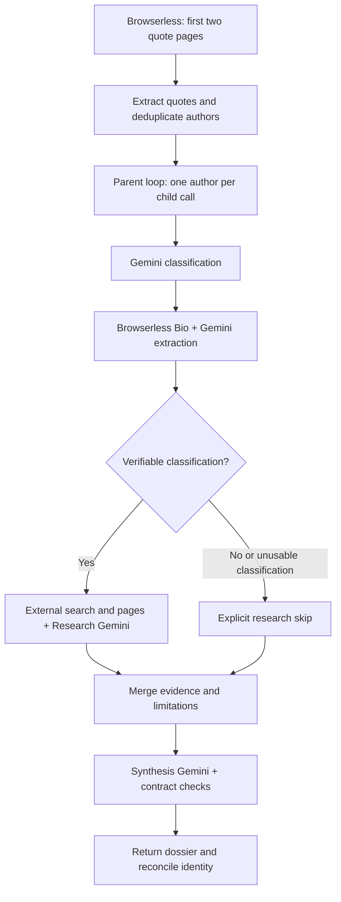

# Author Dossier

An n8n parent/child pipeline that turns quotes from two pages into one evidence-aware dossier per unique author. Browserless retrieves pages; distinct Gemini calls classify authors, extract site biographies, research external sources and synthesize comparisons and profiles.

**Status:** the full workflow completed a real local n8n editor run. All 15 authors were retained. Independent research coverage remains limited; outputs explicitly record degradation rather than claiming complete verification.

## Start here

- [Parent workflow](delivery/ui-verified-execution-17/parent-workflow.json) and [child workflow](delivery/ui-verified-execution-17/child-workflow.json): latest portable imports, with instance and credential bindings removed.
- [Actual final output](delivery/ui-verified-execution-17/batch-output.json): 20 quotes and 15 dossiers from local parent execution #17.
- [Reproduction guide](docs/reproduce.md): import order, credentials, child selection and checks.
- [Search diagnosis](docs/search-candidate-diagnosis.md): evidence locating the main research failure boundary.
- [Synthesis investigation](docs/synthesis-quality-investigation.md): remaining citation/semantic limitations and technical questions.

Download JSON using GitHub's Raw/download control, or clone the repository. Import the parent and child as **two separate workflows**. Repository downloads do not include service credentials.

## Architecture



The parent extracts quote text, author name, tags and biography URL, deduplicates by author URL, and collects one result per author. Classification actively gates research; Bio is attempted for all authors. Each Gemini responsibility has a distinct prompt and call. Skipped or failed research does not silently drop authors.

Research retrieves external search-result HTML through Browserless **`/content`**, decodes links, filters author identity and selects pages within explicit page, round and time budgets. This is not a dedicated Browserless search API integration. Paragraph references preserve provenance; source assessments determine eligibility for independent corroboration.

Synthesis creates explicit comparison tasks for accepted Bio facts. Single-sided evidence is labeled, unresolved results retain limitations, and retries/repair are bounded. These mechanisms enforce structure and coverage, not universal factual correctness.

## Latest observed results

Local n8n **2.38.7**, direct Browserless and Gemini calls, parent execution **#17**:

- Both input pages succeeded: **20 quotes, 15 unique authors**, no missing or duplicate authors.
- Classification and Bio: **15 successful each**.
- Research: **4 partial, 11 failed**; no author reached the configured two-qualified-source target.
- Synthesis: **15 runtime-contract successes**, all with profiles and comparison coverage of accepted Bio facts.
- Final dossiers: **15 degraded, 0 failed, 0 completed**; no batch stop.

See [validation metadata](delivery/ui-verified-execution-17/validation.json). The two-source target is a project quality setting, not a numerical requirement of the original exercise. Operational completion does not establish full independent verification.

An earlier credential-bridge batch and local simulated tests are documented in [the previous acceptance report](docs/final-validation.md). They are separate runs. An initial editor attempt lacked child credential bindings; that configuration issue was corrected before execution #17.

## Known limitations and diagnosis

**Search response relevance:** all 30 saved search responses had HTTP 200 and target HTTP 200. Re-parsing organic-result titles matched the workflow extraction in every case. For 11 authors, both searches yielded no identity-matching candidate. A full Jane Austen query appeared in the page title and search box, while results contained Jane App and unrelated Jane pages. The anomaly is already present in returned search content; its underlying provider/environment cause is unresolved. Weakening identity checks would admit unrelated sources. See [per-search evidence](docs/search-diagnosis-evidence.json).

**Synthesis quality:** valid fact IDs do not prove that each profile claim is supported by its cited subset. Manual review of an earlier run found incomplete attribution. Same-field matching also leaves claim identity and entailment partly dependent on the model. The 2–3 sentence requirement is prompted but not deterministically enforced. These remain quality limitations even when a stage reports success.

**Reproducibility:** destination credentials and child selection must be configured. Website results, provider quotas and the model alias can change. The procedure can be repeated; identical live facts or status counts cannot be guaranteed.

## Run locally

Tested runtime: **Node.js 24.19.0**, **n8n 2.38.7**. From the repository:

```sh
npm test
npm run setup:n8n
npm run test:n8n
```

`npm test` runs offline build, contract and policy checks. `test:n8n` uses the real engine with simulated providers to test mixed failures, shared stop, intake and bounded candidate replacement. It does not validate live search quality. Setup downloads the runtime; simulated execution makes no real provider calls.

On Windows, launch the editor:

```powershell
powershell -ExecutionPolicy Bypass -File .\scripts\local\start-n8n.ps1
```

Visit `http://localhost:5678`, create a local owner account if needed, and follow [the reproduction guide](docs/reproduce.md). Editor and automated-test databases are separate; do not run the editor and CLI tests simultaneously. A full live parent run consumes external service quota and requires authorized credentials.

## Repository layout

- `src/parent`, `src/child`: editable node code; `src/shared`: research/synthesis contracts injected during build.
- `workflows`: templates; `scripts/build.cjs`: development imports in `dist`.
- `tests`: offline fixtures and local n8n harnesses.
- `delivery/ui-verified-execution-17`: latest sanitized editor exports, observed output and SHA-256 checksums. Use this for review; build commands do not overwrite this snapshot.
- `delivery/release-1789324402547`: preserved earlier acceptance snapshot.
- `docs`: reproduction, validation and investigations.

Credentials, databases, raw execution logs and debug working files are excluded from Git. This private repository is intended for invited reviewers; no open-source license has been selected.
